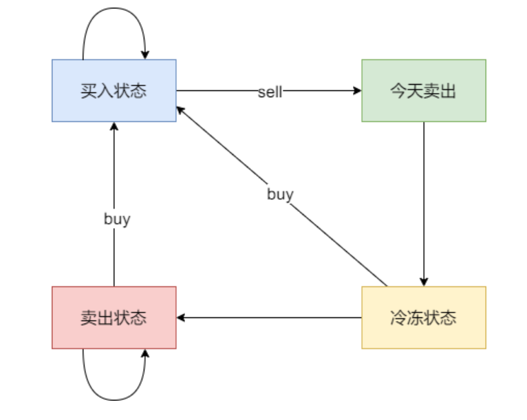

# [188. Best Time to Buy and Sell Stock IV](https://leetcode.com/problems/best-time-to-buy-and-sell-stock-iv/description/)
題目


- 類似題：[123. Best Time to Buy and Sell Stock III](https://leetcode.com/problems/best-time-to-buy-and-sell-stock-iii/description/)
- dp:
  1. dp[i][j]: 在第 i 天的第 j 個狀態下，手上剩餘的最大現金量為 dp[i][j]
  2. dp[i][j], where j = 0,1,2,...k. 
     - 0 表不操作
     - 1 表第一天買入: dp[i][1] = max(dp[i-1][1], -prices[i] + dp[i-1][0])
     - 2 表第一天賣出: dp[i][2] = max(dp[i-1][2], prices[i] + dp[i-1][1])
     - 3 表第二天買入: dp[i][3] = max(dp[i-1][3], -prices[i] + dp[i-1][2])
     - 4 表第二天賣出: dp[i][4] = max(dp[i-1][4], prices[i] + dp[i-1][3])
     - 5. .... 規律是奇數為買入，偶數為賣出!
       - 整理買入賣出公式如下
       - ```python
            for i in range(0, 2 * k - 1, 2):
                dp[i][j + 1] = max(dp[i - 1][j + 1], -prices[i] + dp[i - 1][j]);
                dp[i][j + 2] = max(dp[i - 1][j + 2], prices[i] + dp[i - 1][j + 1]);
         ```
  3. dp[0][0] = 0, dp[0][1] -= prices[0], dp[0][2] = 0, dp[0][3] -= prices[0], dp[0][4] = 0, ....
     - 由上面規律可以觀察到奇數為 -prices[0], 偶數為 0, 整理如下:
     - ```python
          for j in range(1, 2 * k - 1, 2):
            dp[0][j] -= prices[0]
       ```
  4. 由左向右
  5. dry run:
        |      |      | 狀態 j | 0   | 1   | 2   | 3   | 4                            |
        | ---- | ---- | ------ | --- | --- | --- | --- | ---------------------------- |
        | 下標 | 股票 |        |     |     |     |     |                              |
        | 0    | 1    |        | 0   | -1  | 0   | -1  | 0                            |
        | 1    | 2    |        | 0   | -1  | 1   | -1  | 1                            |
        | 2    | 3    |        | 0   | -1  | 2   | -1  | 2                            |
        | 3    | 4    |        | 0   | -1  | 3   | -1  | 3                            |
        | 4    | 5    |        | 0   | -1  | 4   | -1  | <span style="color: red;"> 4 |
```python
class Solution:
    def maxProfit(self, k: int, prices: List[int]) -> int:
        if len(prices) == 0:
            return 0

        dp = [([0] * (2 * k + 1)) for _ in range(len(prices))]

        for j in range(1, 2 * k, 2):
            dp[0][j] -= prices[0]
        
        for i in range(1, len(prices)):
            for j in range(0, 2 * k - 1, 2):
                dp[i][j+1] = max(dp[i-1][j+1], dp[i-1][j] - prices[i])
                dp[i][j+2] = max(dp[i-1][j+2], dp[i-1][j+1] + prices[i])
        
        return dp[len(prices) - 1][2 * k]
```

# [309. Best Time to Buy and Sell Stock with Cooldown](https://leetcode.com/problems/best-time-to-buy-and-sell-stock-with-cooldown/description/)
題目


1. dp[i][j]: 第 i 天的狀態為 j, 手上剩餘的最多現金為 dp[i][j]
   - 狀態轉移可以畫成如下圖 (j 共有四個狀態, 0~3 分別代表狀態一～四):
   - 
2. 遞推公式：
   1. **達到買入股票狀態**: `dp[i][0]: max(dp[i-1][0], -prices[i] + dp[i-1][3], -prices[i] + dp[i-1][1])`
     - 操作一: 前一天就是持有股票的狀態: dp[i][0] = dp[i-1][0]
     - 操作二: 今天買入了，那就有兩種情況
       - 前一天是冷凍期(狀態四): -pricdes[i] + dp[i-1][3] 
       - 前一天是保持股票賣出狀態(狀態二): -prices[i] + dp[i-1][1]
   2. **達到保持賣出股票狀態**: `dp[i][1]: max(dp[i-1][1], dp[i-1][3])`
     - 操作一: 前一天是冷凍期(狀態四): dp[i-1][3]
     - 操作二: 前一天也是保持賣出狀態(狀態二): dp[i-1][1]
   3. **達到今天賣出股票的狀態**: `dp[i][2] = prices[i] + dp[i-1][0]`
     - 操作一: 前一天是持有股票狀態，今天賣出: prices[i] + dp[i-1][0]
   4. **達到冷凍期狀態**: `dp[i][3] = dp[i-1][2]`
     - 操作一: 前一天為賣出狀態，今天為冷凍期: dp[i-1][2]
3. 初始化:
   - dp[0][0] -= prices[0], 其餘為 0
4. 前向後遞推
5. dry run: 最後結果是取狀態 2,3,4 的最大值 （狀態四：冷凍期 如果是最後一天也有可能是最大值
    - 以 [1,2,3,0,2] 為例, dp 如下:
        |      |          | 狀態 j | 0   | 1                            | 2                            | 3                             |
        | ---- | -------- | ------ | --- | ---------------------------- | ---------------------------- | ----------------------------- |
        | 下標 | 股票價格 |        |     |                              |                              |                               |
        | 0    | 1        |        | -1  | 0                            | 0                            | 0                             |
        | 1    | 2        |        | -1  | 0                            | 1                            | 0                             |
        | 2    | 3        |        | -1  | 0                            | 2                            | 1                             |
        | 3    | 0        |        | 1   | 1                            | -1                           | 2                             |
        | 4    | 2        |        | 1   | <span style="color: red;"> 2 | <span style="color: red;"> 3 | <span style="color: red;"> -1 |
```python
class Solution:
    def maxProfit(self, prices: List[int]) -> int:
        if len(prices) == 0:
            return 0

        dp = [[0, 0, 0, 0] for _ in range(len(prices))]
        dp[0][0] -= prices[0]

        for i in range(1, len(prices)):
            dp[i][0] = max(dp[i-1][0], -prices[i] + dp[i-1][3], -prices[i] + dp[i-1][1])
            dp[i][1] = max(dp[i-1][1], dp[i-1][3])
            dp[i][2] = prices[i] + dp[i-1][0]
            dp[i][3] = dp[i-1][2]
        
        return max(dp[len(prices)-1][1:4])
```

# [714. Best Time to Buy and Sell Stock with Transaction Fee](https://leetcode.com/problems/best-time-to-buy-and-sell-stock-with-transaction-fee/description/)


- 與 [122. Best Time to Buy and Sell Stock II](https://leetcode.com/problems/best-time-to-buy-and-sell-stock-ii/description/) 唯一區別在於，一個交易對賣出時有手續費產生, 因此最後反回值的時候，也要考慮手續費造成的影響
```python
class Solution:
    def maxProfit(self, prices: List[int], fee: int) -> int:
        dp = [[0, 0] for _ in range(len(prices))]
        dp[0][0] -= prices[0]

        for i in range(1, len(prices)):
            dp[i][0] = max(dp[i-1][0], -prices[i] + dp[i-1][1])
            dp[i][1] = max(dp[i-1][1], prices[i] + dp[i-1][0] - fee)
        
        return max(dp[len(prices)-1])
```
