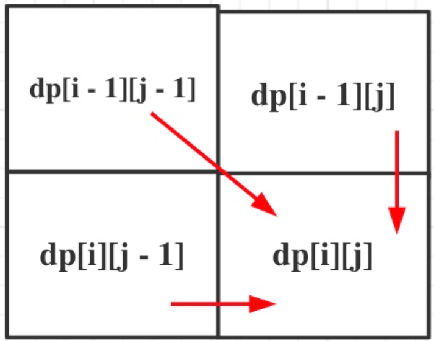

# [300. Longest Increasing Subsequence](https://leetcode.com/problems/longest-increasing-subsequence/description/)
題目

- 思路： 看到子序列直接想到 DP, 但本題與 [718. Maximum Length of Repeated Subarray](https://leetcode.com/problems/maximum-length-of-repeated-subarray/description/) 區別在於，本題可以不連續
  1. dp[i][j] = 長度為 [0, i-1] 的 text1, 與長度為 [0, j-1] 的 text2, 兩者的最長共同子序列為 dp[i][j]
  2. 公式共有兩個分支:
     - text1[i-1] == text1[j-1] (相等情況): dp[i][j] = dp[i-1][j-1] + 1
     - text1[i-1] != text1[j-1] (不相等情況): dp[i][j] = max(dp[i-2][j-1], dp[i-1][j-2])
  3. dp[i][j] = 0
  4. 由遞推公式順序可以看出，有三個方向可以推導出 dp[i][j]:
    - 
  5. dry run: text1 = [a,b,c,d,e], text2 = [a,c,e]
        |     | j   | 0   | 1   | 2   | 3                            |
        | --- | --- | --- | --- | --- | ---------------------------- |
        | i   |     |     | a   | c   | e                            |
        | 0   |     | 0   | 0   | 0   | 0                            |
        | 1   | a   | 0   | 1   | 1   | 1                            |
        | 2   | b   | 0   | 1   | 1   | 1                            |
        | 3   | c   | 0   | 1   | 2   | 2                            |
        | 4   | d   | 0   | 1   | 2   | 2                            |
        | 5   | e   | 0   | 1   | 2   | <span style="color: red;"> 3 |
```python
class Solution:
    def longestCommonSubsequence(self, text1: str, text2: str) -> int:
        dp = [[0] * (len(text2) + 1) for _ in range(len(text1) + 1)]
        res = 0

        for i in range(1, len(text1)+1):
            for j in range(1, len(text2)+1):
                if text1[i-1] == text2[j-1]:
                    dp[i][j] = dp[i-1][j-1] + 1
                else:
                    dp[i][j] = max(dp[i-1][j], dp[i][j-1])
                res = max(res, dp[i][j])
        return res
```

# [1035. Uncrossed Lines](https://leetcode.com/problems/uncrossed-lines/description/)

- 思路: 本題核心觀念與 [300. Longest Increasing Subsequence](https://leetcode.com/problems/longest-increasing-subsequence/description/) 相同，差異只在於 300. 是字串，而本題是數字！
```python
class Solution:
    def maxUncrossedLines(self, nums1: List[int], nums2: List[int]) -> int:
        dp = [[0] * (len(nums2) + 1) for _ in range(len(nums1)+1)]
        res = 0

        for i in range(1, len(nums1)+1):
            for j in range(1, len(nums2)+1):
                if nums1[i-1] == nums2[j-1]:
                    dp[i][j] = dp[i-1][j-1] + 1
                else:
                    dp[i][j] = max(dp[i-1][j], dp[i][j-1])
                res = max(res, dp[i][j])
        
        return res
```

# [53. Maximum Subarray](https://leetcode.com/problems/maximum-subarray/description/)
題目

- 思路： 看到子序列先想到 DP, 但這邊我們在 [Day23-Greedy.md](Day23-Greedy.md) 有使用 Greedy 解過
  1. dp[i]: 以下標 i 為結尾的子序列，其加總為 dp[i]
  2. d[i] = max(dp[i-1] + nums[i], nums[i])
  3. dp[0] = nums[0]
  4. 左至右遍歷
  5. dry run: nums = [-2,1,-3,4,-1,2,1,-5,4]
        | i     | 0   | 1   | 2   | 3   | 4   | 5   | 6   | 7   | 8   |
        | ----- | --- | --- | --- | --- | --- | --- | --- | --- | --- |
        | dp[i] | -2  | 1   | -2  | 4   | 3   | 5   | 6   | 1   | 5   |
```python
class Solution:
    def maxSubArray(self, nums: List[int]) -> int:
        dp = [0] * (len(nums)) 
        res, dp[0] = nums[0], nums[0]

        for i in range(1, len(nums)):
            dp[i] = max(nums[i], dp[i-1] + nums[i])
            res = max(dp[i], res)

        return res
```

