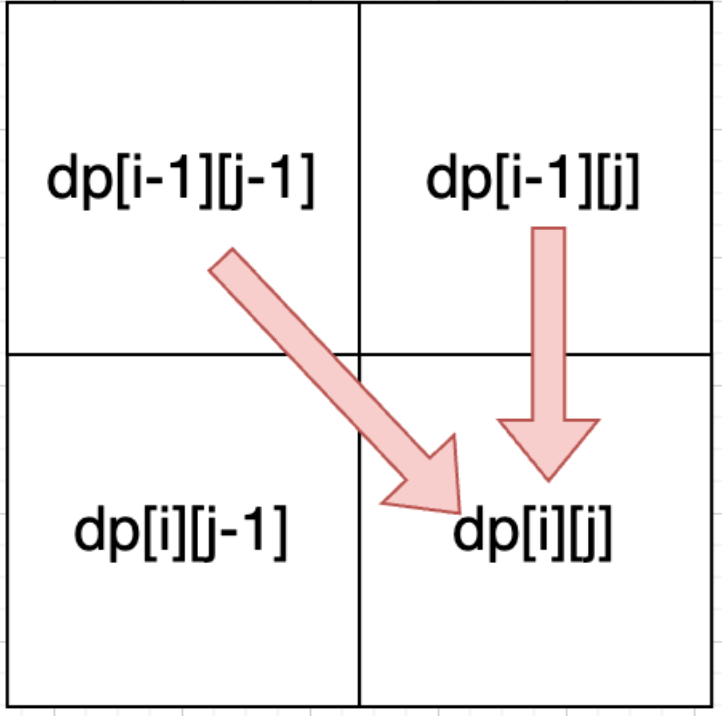

# [115. Distinct Subsequences](https://leetcode.com/problems/distinct-subsequences/description/)
題目


- 思路： [392. Is Subsequence](https://leetcode.com/problems/is-subsequence/description/) 的延伸題，這題是不連續數組，若連續的話可以用 KMP 來解, 本題也無法使用雙指針，因此用 dp 來解
  1. dp[i][j]: 以 i-1 為結尾的 s 子序列中, 出現與 j-1 為結尾的 t 的相符個數為 dp[i][j]
  2. dp[i][j] 公式：分相同與不相同兩種 case 來看
     - s[i-1] == t[j-1]: 這邊相同又分為兩種子 case
       1. 不用 s[i-1] 來匹配 (例如： s:bagg 和 t:bag ，s[3] 和 t[2] 是相同的，但是字符串 s 也可以不用 s[3] 来匹配): dp[i-1][j]
       2. 需要用 s[i-1] 來匹配: dp[i-1][j-1]
       3. dp[i][j] = dp[i-1][j-1] + dp[i-1][j]
     - s[i-1] != t[j-1]: 這邊只有一個 case (因為題目為要求 s 中有多少個 t, 而不是 求 t 中有多少個 s)
       1. dp[i][j] = dp[i-1][j]
  3. **初始化一定要明確，不可以用感覺來初始化**: 
     - 由上面可以得知，這邊的遞推關係為 左->右, 上->下, 那麼， dp[i][0], dp[0][j] 是一定要初始化的 (如下圖)
     - dp[i][0] = 1 (當結尾為 i-1 的 s, 任意刪掉其子序列中的元素後，與空字串 t 的個數為 1)
     - dp[0][j] = 0 (當空字串的 s, 刪掉任意元素後，與 j-1 結尾的相符個數為 0)
     - dp[0][0] = 1 (空字串 s, 刪掉任意元素後, 與空字串 t 的相符個數為 1)
     -   
  4. 從上圖可得知，遞推關係為 左->右, 上->下
  5. dru run: s="baegg", t="bag"
        |     | j   | 0   | 1   | 2   | 3                           |
        | --- | --- | --- | --- | --- | --------------------------- |
        | i   |     |     | b   | a   | g                           |
        | 0   |     | 1   | 0   | 0   | 0                           |
        | 1   | b   | 1   | 1   | 0   | 0                           |
        | 2   | a   | 1   | 1   | 1   | 0                           |
        | 3   | e   | 1   | 1   | 1   | 0                           |
        | 4   | g   | 1   | 1   | 1   | 1                           |
        | 5   | g   | 1   | 1   | 1   | <span style="color: red;">2 |
```python
class Solution:
    def numDistinct(self, s: str, t: str) -> int:
        dp = [[0] * (len(t) + 1) for _ in range(len(s)+1)]
        res = 0

        for i in range(len(s)):
            dp[i][0] = 1
        for j in range(len(t)):
            dp[0][j] = 0
        dp[0][0] = 1

        for i in range(1, len(s)+1):
            for j in range(1, len(t)+1):
                if s[i-1] == t[j-1]:
                    dp[i][j] = dp[i-1][j-1] + dp[i-1][j]
                else:
                    dp[i][j] = dp[i-1][j]
                res = max(res, dp[i][j])

        return dp[-1][-1]
```

# [2707. Extra Characters in a String](https://leetcode.com/problems/extra-characters-in-a-string/description/?envType=daily-question&envId=2024-09-23)
題目


- 思路: 本題與以往遇到的子序列不同處在於，本題找 s 子序列是否出現在給定的 dictionary 內，而不是給定兩個數組比較各自的子序列，但一樣，看到子序列優先想到 dp
  1. dp[i]: [0, i-1] 的 s 的子序列中，扣掉比對 dictionary 的字符數量後，剩餘最少的字符數為 dp[i]
  2. dp[i] = min(dp[i], dp[i-l])
     - 子串 dp[i-l] 中出現於 dictionary 中: 此步驟相當於模擬 s[0,i-1] 的字符數量
     - 子串 dp[i-l] 未出現於 dictionary: 此步驟相當於模擬 s[l,i-1] 的字符數量
  3. dp[0] = 0 (空字串比對 dictionary 後，剩餘字符數為 0), dp[i] = -1 (先將其餘剩餘數量設定為尚未遍歷完, 先隨便給個不可能為答案的初始值, 注意這裡給 0 也可以)
  4. 由上面的公式可以看出，遞推一定是左 -> 右的，並且考量到每次抓出的子串可能都不會出現在 dictionary 中，因此每次遍歷都要給定 dp[i] = dp[i-1], 如下:
  ```python
    for i in range(len(s) + 1):
        dp[i] = dp[i-1] + 1
  ```
  5. dru run: s="leetscode", dict={"leet", "code", "leetcode"}
       | i     | 0   | 1   | 2   | 3   | 4   | 5                            | 6   | 7   | 8   | 9                            |
       | ----- | --- | --- | --- | --- | --- | ---------------------------- | --- | --- | --- | ---------------------------- |
       | i = 1 | 0   | 1   | 2   | 3   | 0   | <span style="color: red;"> 1 | 2   | 3   | 4   | <span style="color: red;"> 1 |
```python
class Solution:
    def minExtraChar(self, s: str, dictionary: List[str]) -> int:
        dp = [-1] * (len(s)+1)
        dp[0] = 0

        for i in range(1, len(s)+1):
            dp[i] = dp[i-1] + 1
            for l in range(1, i+1):
                if s[i-l:i] in dictionary:
                    dp[i] = min(dp[i], dp[i-l])
        
        return dp[-1]
```

# [583. Delete Operation for Two Strings](https://leetcode.com/problems/delete-operation-for-two-strings/description/)
題目


- 思路： 本題與 [115. Distinct Subsequences](https://leetcode.com/problems/distinct-subsequences/description/) 不同處在於，這裡可以操作的範圍變成兩個數組，但基本的思路是相同的
  1. dp[i][j]: 以 i-1 為的 word1 的字串，與 j-1 為結尾的字串 word2, 兩者要達到相同字串所需進行的最少操作次數為 dp[i][j]
  2. dp[i][j] 公式：
     - word1[i-1][j-1] == word2[i-1][j-1]:
        1. case1: 只刪除 word1[i-1]: dp[i][j] = dp[i-1][j] + 1 
        2. case2: 只刪除 word2[j-1]: dp[i][j] = dp[i][j-1] + 1 
        3. case3: 同時刪除 word1[i-1]與word2[j-1]: dp[i][j] = dp[i-1][j-1] + 2
     - word[i-1][j-1] != word2[i-1][j-1]:
        1. dp[i][j] = dp[i-1][j-1]
  3. 初始化
     - dp[i][0]: 以 i-1 為結尾的 word1 字串中, 與空字串為結尾的 word2, 要打到相等的話, 所需的最少操作次數為 i
     - dp[0][j]: 同上 >> j
     - dp[0][0]: 同上 >> 0
  4. 由上可以得知 dp[i][j] 來源一定是上->下，左->右
  5. dru run: s="sea", t="eat"
        |     |       | 0     | 1   | 2   | 3                            |
        | --- | ----- | ----- | --- | --- | ---------------------------- |
        | i   |       | word2 | e   | a   | t                            |
        | 0   | word1 | 0     | 1   | 2   | 3                            |
        | 1   | s     | 1     | 2   | 3   | 4                            |
        | 2   | e     | 2     | 1   | 2   | 3                            |
        | 3   | a     | 3     | 2   | 1   | <span style="color: red;"> 2 |
```python
class Solution:
    def minDistance(self, word1: str, word2: str) -> int:
        dp = [[0] * (len(word2) + 1) for _ in range(len(word1)+1)]

        for i in range(len(word1)+1):
            dp[i][0] = i
        for j in range(len(word2)+1):
            dp[0][j] = j

        for i in range(1, len(word1)+1):
            for j in range(1, len(word2)+1):
                if word1[i-1] == word2[j-1]:
                    dp[i][j] = dp[i-1][j-1]
                else:
                    dp[i][j] = min(dp[i-1][j-1]+2, dp[i-1][j]+1, dp[i][j-1]+1)
        
        return dp[-1][-1]
```

# [72. Edit Distance](https://leetcode.com/problems/edit-distance/description/)
題目


- 思路： 此題與 [583. Delete Operation for Two Strings](https://leetcode.com/problems/delete-operation-for-two-strings/description/) 不同在於 “操作方法”，本題允許“增刪改”三種操作方法，而該題只允許刪除方法
```python
class Solution:
    def minDistance(self, word1: str, word2: str) -> int:
        dp = [[0] * (len(word2) + 1) for _ in range(len(word1)+1)]

        for i in range(len(word1)+1):
            dp[i][0] = i
        for j in range(len(word2)+1):
            dp[0][j] = j

        for i in range(1, len(word1)+1):
            for j in range(1, len(word2)+1):
                if word1[i-1] == word2[j-1]:
                    dp[i][j] = dp[i-1][j-1]
                else:
                    dp[i][j] = min(dp[i-1][j-1], dp[i-1][j], dp[i][j-1])+1
        
        return dp[-1][-1]
```
