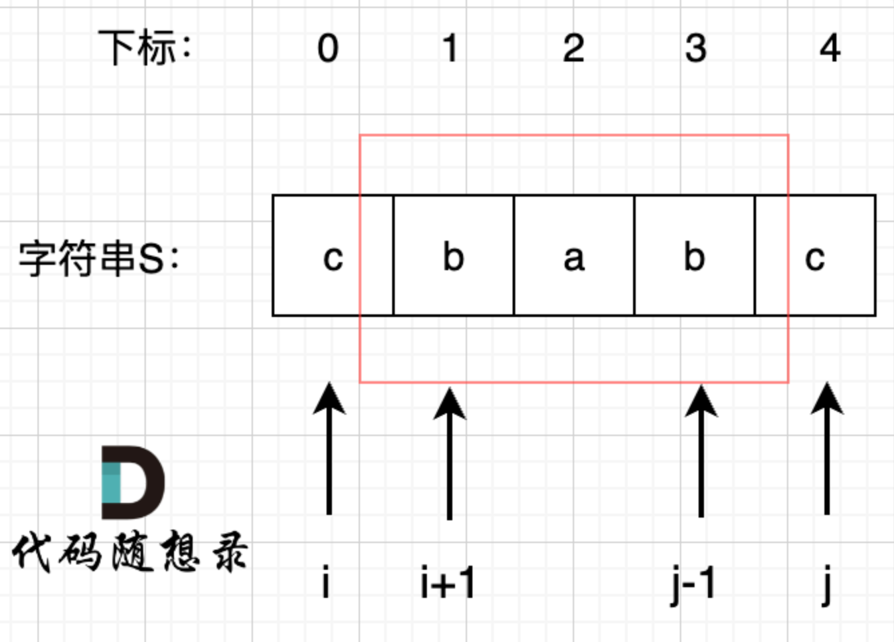
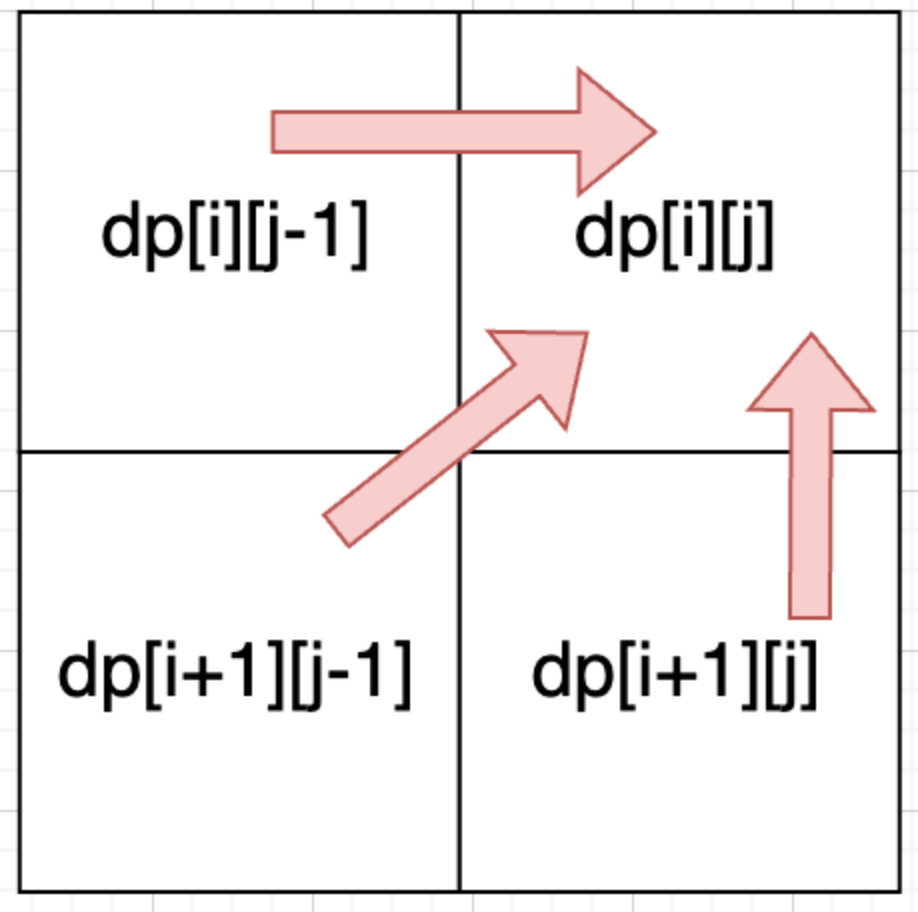

# [647. Palindromic Substrings](https://leetcode.com/problems/palindromic-substrings/description/)
題目


- 思路: 本題思考關鍵在於我們 **如何利用上次的狀態，推敲出目前狀態**，仔細觀察題目與迴文性質:
  - 我們在判斷字串S是否是回文，如果我們知道s[1]，s[2]，s[3]這個子字串是回文的，那麼只需要比較s[0]和s[4]這個元素是否相同，如果相同的話，這兩個字串就是回文字串 (如下圖)
  -   
1. dp[i][j] 定義：布林類型的 dp[i][j]：表示區間範圍 [i,j] （左閉右閉）的子字串是否是回文子字串，如果是, dp[i][j] 為true，否則為 false
2. 公式： dp[i][j], for all j >= i
   -  s[i] != s[j]: dp[i][j] = false
   -  s[i] == s[j]:
      1.  j-i == 0: 代表同個字串, dp[i][j] = true
      2.  j-i == 1: 代表 "aa" dp[i][j] = true
      3.  j-i > 1: 此時就要觀察 dp[i+1][j-1] 是否回文，如果是，那 dp[i][j] = true，否則 false
3. 初始化: dp[i][j] = false
4. 遞推順序：由上面的公式可以得知，dp[i][j] 需要由 dp[i+1][j-1] 得知，因此，這裡的**遞推順序必須是下 -> 上．左 -> 右**
5. dru run: s="sea", t="eat"
    |     | j   | 0   | 1   | 2   |
    | --- | --- | --- | --- | --- |
    | i   |     | a   | a   | a   |
    | 0   | a   | 1   | 1   | 1   |
    | 1   | a   | 0   | 1   | 1   |
    | 2   | a   | 0   | 0   | 1   |
```python
class Solution:
    def countSubstrings(self, s: str) -> int:
        dp = [[False] * len(s) for _ in range(len(s))]
        res = 0
        
        for i in range(len(s)-1, -1, -1):
            for j in range(len(s)):
                if s[i] == s[j]:
                    if j - i == 0:
                        res += 1
                        dp[i][j] = True
                    elif j - i == 1:
                        res += 1
                        dp[i][j] = True
                    elif j - i > 1:
                        if dp[i+1][j-1]:
                            res += 1
                            dp[i][j] = True
        return res
```
# [516. Longest Palindromic Subsequence](https://leetcode.com/problems/longest-palindromic-subsequence/description/)
題目


- 思路: 本題與 [647. Palindromic Substrings](https://leetcode.com/problems/palindromic-substrings/description/) 差異在於, 本題不要求連續, 但基本思路是一至的
    1. dp[i][j]: 字串 s 在範圍 [i,j] 內，最長的回文字串長度為 dp[i][j]
    2. dp[i][j]
        - s[i] 與 s[j] 不相等: 如果s[i]與s[j]不相同，表示s[i]和s[j]的同時加入並不能增加[i,j]區間回文子序列的長度，那麼分別加入s[i]、s [j]看看哪一個可以組成最長的回文子序列; 我們一定要與大的，因此: d[i]j[j] = max(dp[i+1][j], dp[i][j-1])
        - s[i] 與 s[j] 相等: dp[i][j] = dp[i+1][j-1] + 2
    3. 從上面公式可以得知，我們 j, i 是碰不到相等情況的，因此初始化這邊要給定初始值 dp[i][i] = 1, 其餘為 0
    4. 遞推公式：由下圖可以得知，順序應該要是，下 -> 上， 左 -> 右
        -   
    5. dry run: s = "cbbd"
        |     | j   | 0   | 1   | 2   | 3   |
        | --- | --- | --- | --- | --- | --- |
        | i   |     | c   | b   | b   | d   |
        | 0   | c   | 1   | 1   | 2   | 2   |
        | 1   | b   | 0   | 1   | 2   | 2   |
        | 2   | b   | 0   | 0   | 1   | 1   |
        | 3   | d   | 0   | 0   | 0   | 1   |
```python
class Solution:
    def longestPalindromeSubseq(self, s: str) -> int:
        dp = [([0] * len(s)) for _ in range(len(s))]

        for i in range(len(s)):
            dp[i][i] = 1

        for i in range(len(s)-1, -1, -1):
            for j in range(i+1, len(s)):
                if s[i] == s[j]:
                    dp[i][j] = dp[i+1][j-1] + 2
                else:
                    dp[i][j] = max(dp[i][j-1], dp[i+1][j])
        
        return dp[0][-1]
```
